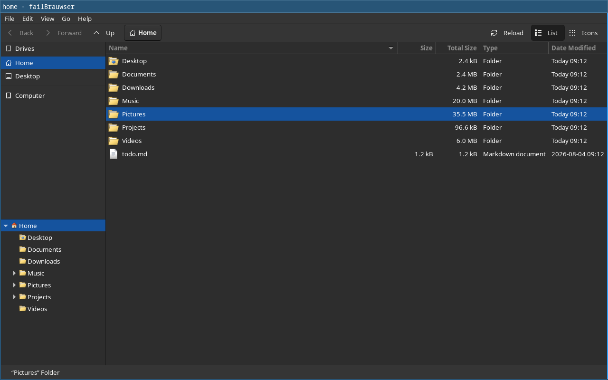
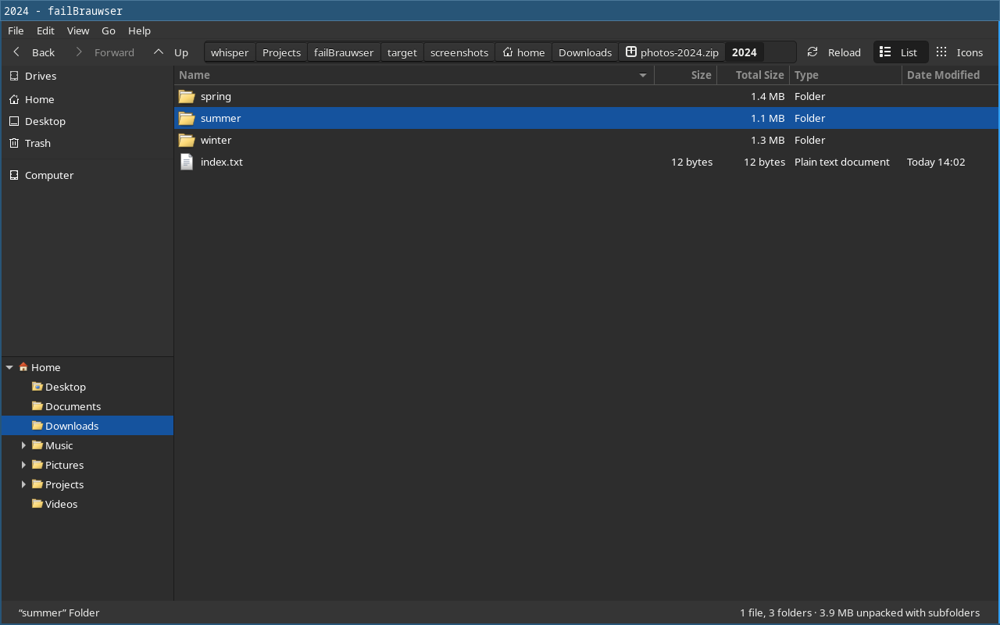
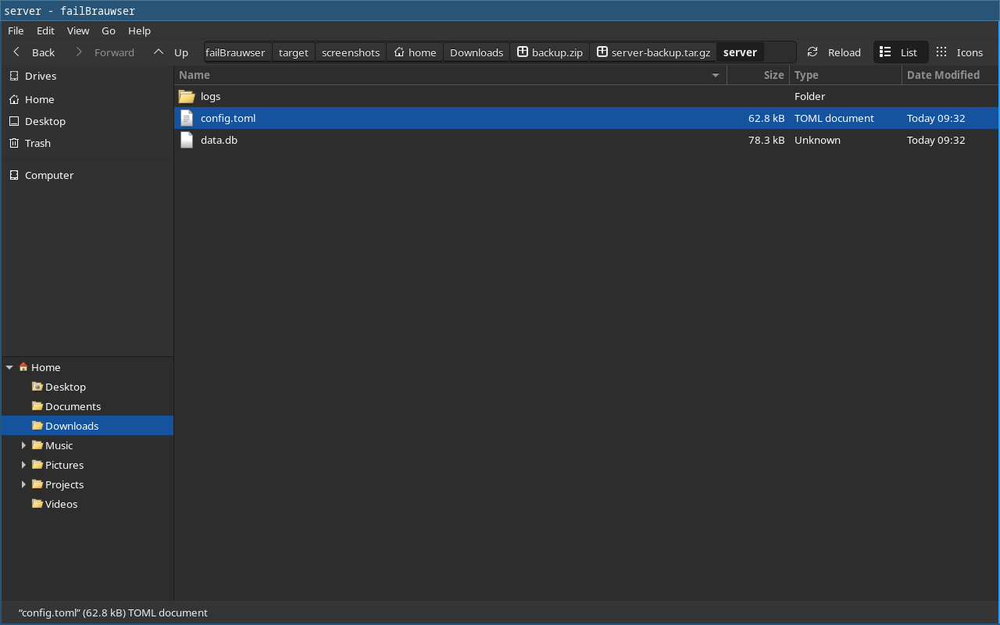
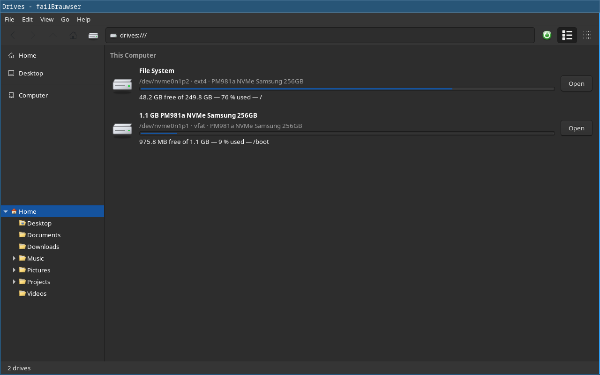
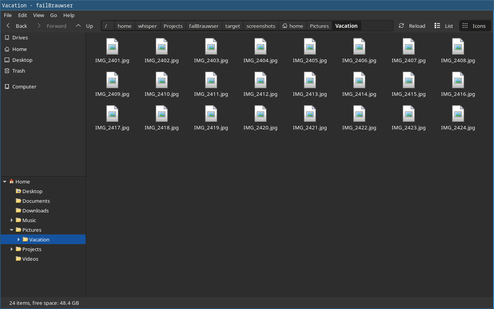
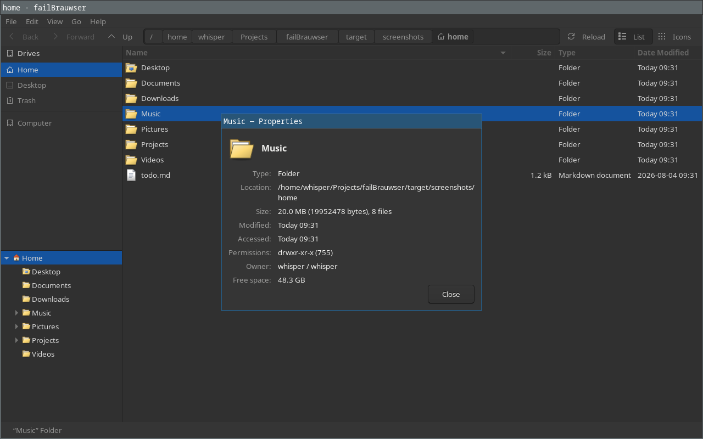
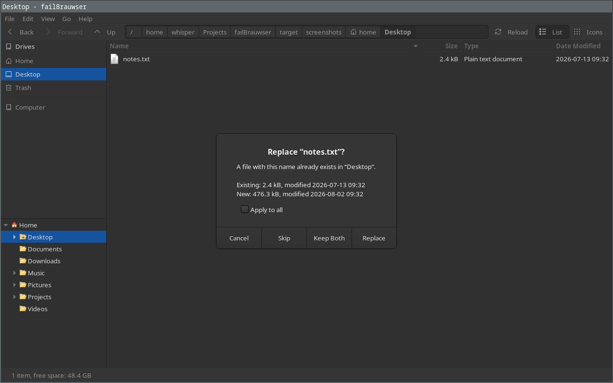
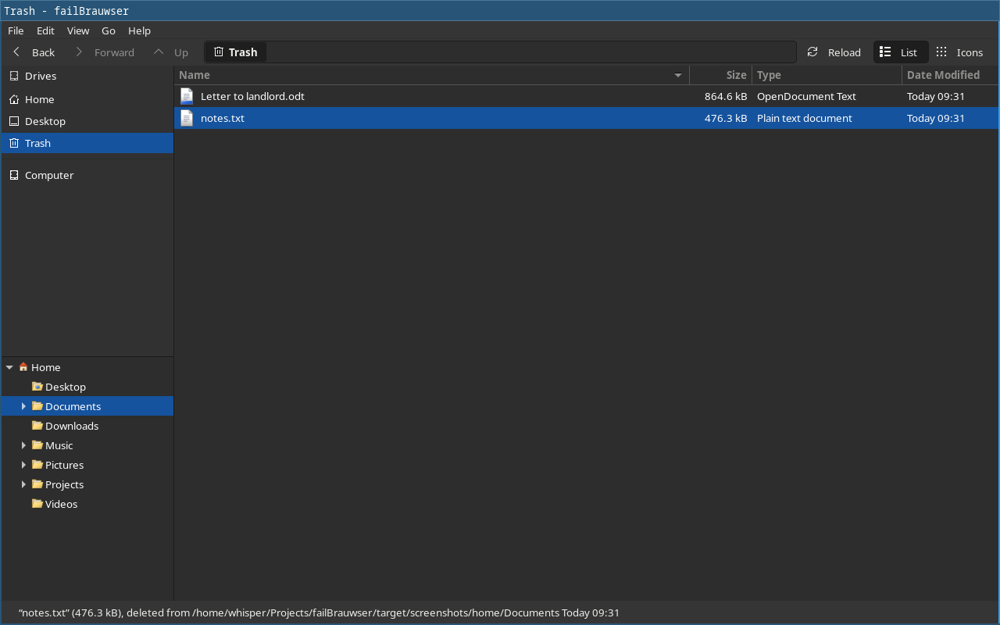
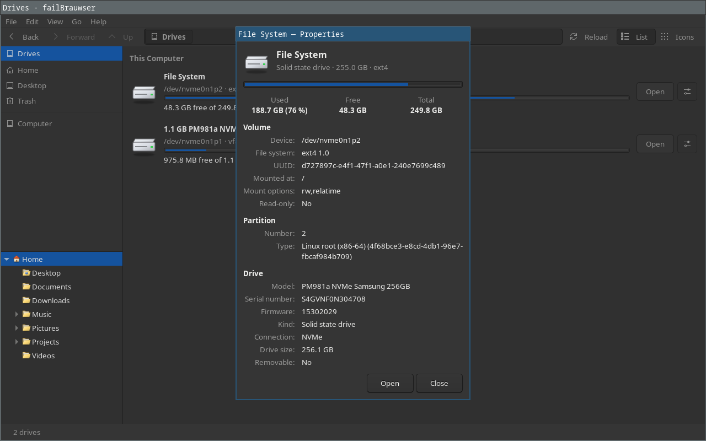
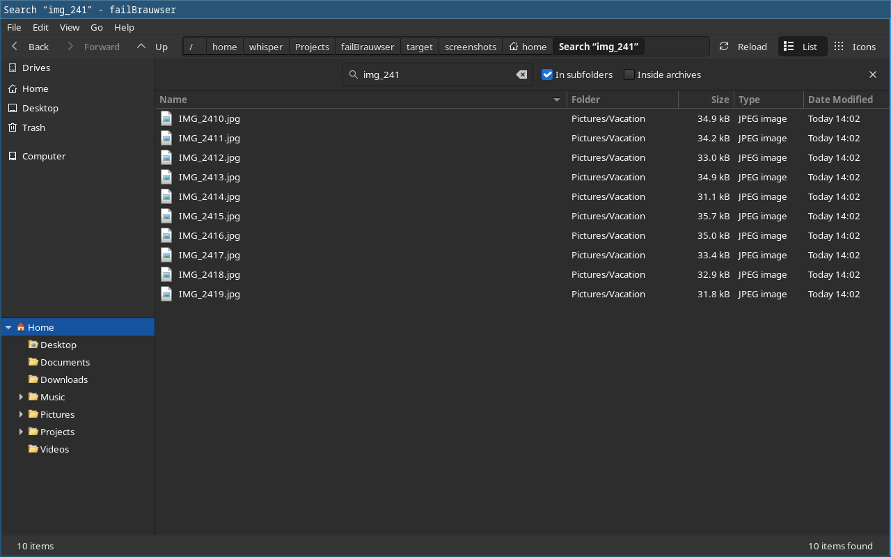

# failBrauwser

A fast, native GTK 3 file manager in the spirit of Thunar — that opens archives like folders.



- **Fast copies.** Reflinks where the filesystem can, in-kernel `copy_file_range` otherwise,
  and many small files copied in parallel. Writes to USB sticks and spinning disks are paced,
  so the system never stalls behind gigabytes of cached data and unmounting is instant.
- **Archives are folders.** Enter a `.zip`, `.7z`, `.tar.gz`, a disk image or any of the
  ~480 formats the archive library knows, even an archive inside an archive, and copy, paste,
  rename, delete or create files in it like anywhere else. Open a file from inside an archive,
  edit it, save — the archive is updated. *Compress…* writes about 350 of these formats.
- **Looks like your desktop.** Native GTK widgets and your GTK theme, icon theme and fonts;
  nothing is custom-drawn.
- **Opens instantly.** After the first start a background instance keeps running; a new
  window appears ~40 ms after you click the launcher, using no CPU while idle.
- **Drives page** with every volume, its fill level and mount point; mount, unmount and eject
  without freezing the window, and a properties window per drive (UUID, partition, model,
  serial, SSD or HDD, mount options, …).
- **Trash shared with Thunar** and other file managers (freedesktop.org spec): browse it,
  restore to the original place, delete permanently, empty.
- **Thumbnails** for pictures, videos and documents (shared with other file managers), and
  zoom from tiny rows to big icons with <kbd>Ctrl</kbd>+scroll.
- **Search** (<kbd>Ctrl</kbd>+<kbd>F</kbd>) through subfolders and even inside archives, with
  results streaming in.
- **Copy jobs you control:** pause and resume, copies to the same drive wait in a queue instead
  of fighting each other, and optional read-back verification.
- **Custom actions** from Thunar (`uca.xml`) in the right-click menu, and *Open Terminal Here*.
- **More details.** A *Total Size* column with recursive folder sizes (symlink-safe), a
  configurable column set, shortcuts and a folder tree rooted at the current folder, your home
  or `/`.

## Screenshots

| Inside a zip | Archive inside an archive |
|---|---|
|  |  |

| Drives | Icon view |
|---|---|
|  |  |

| Properties | Copy conflict |
|---|---|
|  |  |

| Trash | Drive properties |
|---|---|
|  |  |

| Search |  |
|---|---|
|  |  |

The screenshots are generated by `scripts/screenshots.sh` in a headless compositor with the
current desktop theme (here: Adwaita dark with Breeze colors and a Windows XP icon theme).

## Install

```sh
./install.sh                # for your user, into ~/.local
./install.sh --system       # for everyone, into /usr/local (uses sudo)
./install.sh --default      # …and make it the default file manager
./install.sh --uninstall    # remove it again (same options as for installing)
```

The script builds everything, installs the program, the archive helper, a launcher and the icon,
and registers a background instance that starts with your session (`--no-autostart` to skip
that; windows then take a moment longer the first time).

### Requirements

- Rust 1.92 or newer, GTK 3.24 (development files), `pkg-config`
- For archives: the .NET 10 SDK (the archive library is included in `vendor/`). Without it
  failBrauwser works, minus archives.
- Optional at run time: UDisks2 (drives page details and mounting), GVfs (trash, places;
  with its backends such as `gvfs-smb`, network addresses like `smb://host/share`).

## Using it

| Keys | Action |
|---|---|
| <kbd>Ctrl</kbd>+<kbd>N</kbd> / <kbd>Ctrl</kbd>+<kbd>T</kbd> | New window / tab |
| <kbd>Alt</kbd>+<kbd>←</kbd> <kbd>→</kbd> <kbd>↑</kbd>, <kbd>Backspace</kbd> | Back, forward, up |
| <kbd>Alt</kbd>+<kbd>Home</kbd> / <kbd>Alt</kbd>+<kbd>D</kbd> | Home / Drives |
| <kbd>Ctrl</kbd>+<kbd>L</kbd> | Type a location (also paths through archives: `~/a.zip/docs`) |
| <kbd>Ctrl</kbd>+<kbd>C</kbd> <kbd>X</kbd> <kbd>V</kbd> | Copy, cut, paste (works with other file managers too) |
| <kbd>F2</kbd>, <kbd>Delete</kbd>, <kbd>Shift</kbd>+<kbd>Delete</kbd> | Rename, move to trash, delete |
| <kbd>Ctrl</kbd>+<kbd>Shift</kbd>+<kbd>N</kbd> | New folder |
| <kbd>Ctrl</kbd>+<kbd>H</kbd> | Show hidden files |
| <kbd>Ctrl</kbd>+<kbd>1</kbd> / <kbd>Ctrl</kbd>+<kbd>2</kbd> | Detailed list / icons |
| <kbd>Ctrl</kbd>+<kbd>+</kbd> <kbd>-</kbd> <kbd>0</kbd>, <kbd>Ctrl</kbd>+scroll | Zoom in, out, normal size |
| <kbd>Ctrl</kbd>+<kbd>F</kbd> | Search |
| <kbd>F5</kbd>, <kbd>F9</kbd>, <kbd>Alt</kbd>+<kbd>Enter</kbd> | Reload, side panel, properties |

**Path bar:** every step of the path, from `/`, is a button; the folder you are in is shown
pressed, and the last step always stays in view. Click the empty space right of the last
button (the text cursor shows where; or press
<kbd>Ctrl</kbd>+<kbd>L</kbd>) to type a location; <kbd>Enter</kbd> or <kbd>Esc</kbd> returns to
the buttons. A network address (`smb://host/share`, `sftp://host/dir`, …) is mounted
through GVfs, asking for a password if needed, and opens as its local GVfs folder.
While you type one, the bar suggests addresses opened before, SMB servers found on the
local network (searched in the background, about two seconds) and, once a server is typed
with its slash, that server's shares. Home and Drives are in the side panel.

Click empty space in the list to clear the selection (and to leave the typed path).
The status bar shows how many files and folders the current folder holds and how much space
it needs, subfolders included.

Drag and drop moves within a filesystem and copies across filesystems; hold
<kbd>Shift</kbd> to move, <kbd>Ctrl</kbd> to copy, both to link. Middle-click a folder to open it
in a new tab.

**Columns:** *View → Columns* or right-click a column header. *Total Size* adds up folders
recursively on background threads. Symbolic links are never followed (a link to `/` would
count the whole disk, link loops would never end), hard-linked files count once, and mounted
filesystems below a folder are not entered.

**Folder tree:** *View → Folder Tree → Tree Starts At* the current folder, your home folder or
`/`. The shortcuts above it are GTK's own places: home, bookmarks, and drives with
mount/eject.

**Thumbnails:** *View → Show Thumbnails*. failBrauwser uses the freedesktop.org thumbnail
cache (`~/.cache/thumbnails`), so thumbnails made by Thunar, Nautilus or Dolphin are reused
and the ones it makes are theirs too. Missing ones are requested from Tumbler (the thumbnailer
service of Xfce) when it is installed, which covers videos, PDFs and office documents;
otherwise failBrauwser makes picture thumbnails itself. Only rows you can see are
thumbnailed.

**Zoom:** <kbd>Ctrl</kbd>+scroll, <kbd>Ctrl</kbd>+<kbd>+</kbd> / <kbd>-</kbd> or
*View → Zoom*; the list and the icon view keep their own size.

**Search:** <kbd>Ctrl</kbd>+<kbd>F</kbd> opens the search bar above the list. Type part of a
name, or a pattern with `*` and `?`; results stream in with the folder they were found in,
and act like files anywhere else (open, copy, rename, trash, properties). *In subfolders* and
*Inside archives* widen the search. Symbolic links are not followed and other drives are not
entered. <kbd>Esc</kbd> closes it.

**Archives:** double-click an archive to enter it. Every format the library knows opens this
way: archives (ZIP, 7-Zip, RAR, TAR, CAB, LHA, ARJ, StuffIt, …), compressed files (`.gz`,
`.xz`, `.zst`, `.br`, `.lz4`, …), disk and file system images (ISO, FAT, exFAT, ext2/3/4,
NTFS, HFS+, SquashFS, VHD/VHDX, VMDK, QCOW2, VDI, UDF, …) and packages (`.deb`, `.rpm`,
`.whl`, …). A file without a suffix, or with one that says nothing (`.bin`, `.img`, `.dat`),
opens as a folder too when the library recognises its contents and no application is set up
for it. Files that belong to another program — office documents, e-books, pictures, fonts,
programs and installers, databases — still open with that program; *Open as Archive* shows
what is inside them, and inside audio and video files too. *Extract Here*, *Extract To…* and
*Compress…* are in the context menu. Long archive operations show a progress bar with the
bytes done. Formats the library can only read are shown read-only, and the status bar says
why.

**Compressed files** such as `notes.txt.gz` show the one file inside; open it, edit it and
save, and the file is compressed again. *Extract Here* gives `notes.txt` itself.

**Compress…** offers ZIP, 7-Zip and the tar formats first, then every other format the
library can write in submenus: *Compressed File* (for a single file), *Archives* and *Disk
Images* (FAT, ext4, NTFS, ISO, VHD, …, with folders and long names). The password fields
are active for formats that encrypt.

**Passwords:** encrypted archives ask for their password when you enter them, open a file or
extract, and ask again if it was wrong. *Compress…* can create password-protected `.zip`
and `.7z` archives. Files added to an encrypted archive are encrypted with the same
password.

**ISO images** open and edit like folders: add, delete, rename and create folders. The image
is rebuilt with Rock Ridge (long names, permissions, times) and Joliet names, and the El Torito
boot records of bootable images (BIOS and UEFI) are kept. Hybrid images written for USB sticks
(an extra partition table in the first sectors) stay read-only, since a rebuild would break
the partitions.

**Copy jobs:** the progress window has a pause button per job. A copy to a drive that is
already being written to waits in a queue and starts when the first one is done. With
*Edit → Verify Copies* every copied file is flushed to the device, dropped from the cache and
read back to compare it with the source.

**Custom actions:** actions you made in Thunar (*Edit → Configure custom actions*, stored in
`~/.config/Thunar/uca.xml`) appear in the right-click menu, filtered by file patterns and
types like in Thunar. Actions only for failBrauwser go into
`~/.config/failbrauwser/actions.xml` (same format; *Edit Custom Actions…* in the menu creates
it with an example). *Open Terminal Here* is built in and uses `$TERMINAL` or the first
terminal found.

**Trash:** *Move to Trash* (<kbd>Delete</kbd>) follows the freedesktop.org Trash
specification, exactly like Thunar, Nautilus and Dolphin: the file goes to
`~/.local/share/Trash/files/` (or `.Trash-<uid>/` on other drives) and a
`info/<name>.trashinfo` records its original path and the deletion time. Items trashed in
any of these file managers show up in *Trash* on the left. The bar above the list there has
*Restore* (for the selection) and *Empty Trash*. Restoring puts items back — to
where they came from, recreating missing folders and asking if the name is taken — or
deleted for good. The status bar shows where a selected item was deleted from.

**Drives:** *Drives* on the left lists every volume; the button at the end of a row (or a
right-click, or <kbd>Alt</kbd>+<kbd>Enter</kbd>) shows its properties.

**Settings** live in `~/.config/failbrauwser/settings.ini` and are changed from the menus;
*Edit → Keep Running in Background* and *Edit → Smooth Writes to Slow Drives* switch off the
daemon and the write pacing.

`failbrauwser --quit` ends the background instance; `failbrauwser --help` lists the options.

## How it is fast

**Copying** (`src/ops/`) plans the whole tree first (for an honest progress bar), creates the
folders, then copies files with several workers. Per file it tries, in this order:

1. `FICLONE` — a reflink, instant on btrfs, XFS and bcachefs;
2. `copy_file_range` — the kernel copies, no data passes through the program (server-side on
   NFS 4.2 and SMB);
3. `read`/`write` with a 1 MiB buffer.

Many small files are bound by per-file latency, not bandwidth. Workers are spread over
different folders at once (creating files in one folder is serialized by the filesystem),
permissions are only set when the umask changed them, and nothing is `fsync`ed per file. On a
spinning source, files are read in inode order to avoid seeking. The worker count follows the
devices: up to 8 on SSDs, 6 on network shares, 2 on USB, 1 on hard disks.

| 20 000 files × 4 KiB, NVMe/ext4, warm cache | time |
|---|---|
| `cp -r` | 610 ms |
| failBrauwser | 170 ms |

(`cargo run --release --example bench_copy -- <src> <dest>`)

**Slow drives:** on removable and rotational targets, data is written back in 8 MiB windows:
each window is handed to the device, the previous one is waited for and dropped from the page
cache (`sync_file_range` + `POSIX_FADV_DONTNEED`). Only a few megabytes are ever dirty, so the
progress bar shows the real device speed, other programs do not stall, and the final
`syncfs` — after which the operation reports done — takes no time. Unplugging is safe the
moment the progress window closes.

**Unmounting** goes through UDisks2 asynchronously; tabs showing the drive move away first so
they do not keep it busy.

**Starting:** a second `failbrauwser` does not start GTK at all; it hands its command line over
D-Bus to the running instance and exits. With the background instance from the autostart entry,
a window is on screen about 40 ms after launch. When its last window closes, the instance drops
its caches and returns memory (about 50 MB resident while waiting, 0 CPU time measured over idle periods).

**Browsing:** folders are read on worker threads and shown in one batch; live changes come from
inotify and are applied row by row. Sorting compares precomputed natural-order ranks, not
strings.

## Architecture

```
src/
  lib.rs           everything testable without a display
    fs/            entries, listing, formatting, recursive sizes
    ops/           copy engine, delete/trash, device classes, jobs
    archive/       helper client, archive tree, VFS (nested archives, write-back)
    location.rs    folders, paths through archives, the drives page
    remote.rs      network address history, SMB servers on the local network
    drives.rs      UDisks2 / mount table, fill levels
    config.rs      settings
    search.rs      file name search, also inside archives
    thumbs.rs      freedesktop.org thumbnail cache
    actions.rs     custom actions (Thunar uca.xml)
  ui/              GTK: window, tabs, sidebar, drives page, jobs, clipboard, dnd, archives
helper/FbArchive/  fb-archive: C# (NativeAOT) host for CompressionWorkbench's archive logic
tests/             engine, archive and headless UI tests
```

Archive support is the work of **[@Hawkynt](https://github.com/Hawkynt)**: his
[CompressionWorkbench](https://github.com/Hawkynt/CompressionWorkbench) reads and writes
hundreds of archive, compression and file system formats. The parts failBrauwser needs are
included in `vendor/compressionworkbench` (see `VENDORED.md` there for the upstream commit and
every local change), so this repository builds on its own.

failBrauwser uses the archive logic of CompressionWorkbench (`Compression.Lib`) through a
small NativeAOT helper, `fb-archive`, spoken to with one JSON object per line on stdin/stdout.
It starts in about 15 ms, only when an archive is opened, and exits after 45 s without work,
so plain browsing never carries the .NET runtime. Nested archives are extracted into
`$XDG_RUNTIME_DIR/failbrauwser`, edited there and written back into their containers.

### Changes to CompressionWorkbench

Editing archives like folders needed fixes in the library, made in the vendored copy and
listed in `vendor/compressionworkbench/VENDORED.md`:

- Removing an entry through a rebuild also removed every file with the same *leaf name* in
  other folders (`a.txt` took `sub/a.txt` with it), compared case-insensitively, and left the
  folder entry of a removed folder behind. Names now match exactly, and folders go with their
  contents.
- Adding an empty folder to an existing archive silently did nothing (rebuild path and ZIP).
- Rebuilds reset all timestamps to 1970/1980 and dropped executable bits. TAR and ZIP now keep
  entry times and modes, and restore them on extraction; TAR listings report UTC.
- Progress: reads report how many bytes were consumed, so long operations show a real
  progress bar.
- ISO images: the reader prefers Rock Ridge names (and reads permissions, times and
  continuation areas); the writer gained Rock Ridge, folders, file metadata and El Torito boot
  records (catalog, BIOS and UEFI entries, boot info table), so images can be edited.
- New disk images lost their folders: ISO, ext2/3/4, NTFS, XAR and the CD images (CDI, MDF,
  NRG, BIN) wrote every file into the top folder, and VHD, VHDX, VMDK, VDI and QCOW2 turned
  names into upper-case 8.3. They now keep folders, empty folders and long names; ext, NTFS
  and XAR also add and remove inside folders.
- XAR files were rejected by `xar` and libarchive (a missing table-of-contents checksum).
- Edits that deleted the wrong file: BBC Micro disks removed `A.TXT` along with `C.TXT`,
  BKF backups removed same-named files from every folder and added into the wrong one, the
  shared rebuild path matched leaf names, and MFS-1 cut other files' names down to their
  extension.
- Two formats (xDisk, xMash) were never recognised, because their names differ in case.
- Regression tests: `helper/FbArchive.Tests` (run by `make test`), among them a round trip of
  every format failBrauwser can write — create, recognise, list, extract, add, remove —
  against a baseline of known outcomes (`format-baseline.tsv`), and checks of the results
  with `e2fsck`, `debugfs`, `bsdtar`, `fsck.fat`, `qemu-img` and `xorriso` where installed.

## Development

```sh
make            # app + archive helper
make test       # builds the helper, runs all tests
cargo test      # the same, if the helper is built already
scripts/screenshots.sh
```

The UI tests (`tests/ui/*.fbt`) drive the real application through its actions in a headless
sway session with a private D-Bus and private config, data and trash folders; they need
`sway`, `grim` and `dbus-run-session` and are skipped otherwise. `FB_SELFTEST=<script>` runs
such a script (see `src/ui/selftest.rs` for the commands).

## Limitations

- Network addresses need GVfs's FUSE daemon (`gvfsd-fuse`); locations without a local path
  (`mtp://`) are not browsable yet.
- Of the formats failBrauwser can write, about 270 keep files exactly. The rest are what
  their format is: old disk formats store upper-case 8.3 names or pad files to whole sectors
  (CP/M, RT-11, LIF, PlayStation memory cards), some formats have no folders, a few need
  particular inputs (icons, fonts, subtitles), and container formats such as PDF or e-mail add
  entries of their own. `helper/FbArchive.Tests/format-baseline.tsv` lists each one.
- CD images (CDI, MDF, NRG, BIN) show plain ISO 9660 names (upper case); BIN/CUE and ODS-1
  are read-only.
- Edits to formats without in-place modification rebuild the archive.
- Hybrid ISO images are read-only; Rock Ridge names longer than about 170 bytes are
  shortened when an ISO is rebuilt.
- The folder total in the status bar follows changes in the folder itself; changes deeper
  down show after <kbd>F5</kbd>.

## License

GPL-3.0-or-later. The archive helper links CompressionWorkbench by
[@Hawkynt](https://github.com/Hawkynt) (LGPL-3.0-or-later, `vendor/compressionworkbench/LICENSE`).
